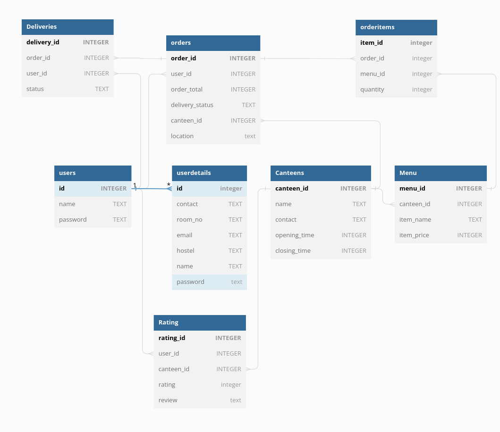

# Hackathon

# IIITeats: _A website for placing orders and taking deliveries_

## Table of Contents

- [Summary](#Summary)
- [Technologies used](#technologies-used)
- [Database Structure](#database-structure)
- [How to use the website](#How-to-use-the-website)
- [Instructions](#instructions)
- [Frameworks and Packages](#frameworks-and-packages)
- [Contributions](#contributions)

## Summary

Ever asked your friend at Tantra to get you some fried rice just because you were too lazy to walk out and get it yourself? But what if your nightmares come true and it turns out none of your friends are at the canteen? Fear no more! Introducing IIITEats: a decentralized freelancing-style delivery solution for the IIIT community to simplify intra-campus deliveries while making some money off of it. Craving a shawarma from Tantra? Just place your order on the app and someone currently at the canteen can deliver it to your room for some extra fee. At some canteen and looking to make a quick buck? Open up the app to see the current orders people have placed so you can deliver it to them!

## Technologies Used

- HTML
- CSS
- JS
- Python
- SQLite3

## Database Structure

## How to use the website

### SET UP

Extract the zip file 26.zip and run 'python3 app.py' on terminal in the same directory. Click on the local address to get directed to the home page of the website, where the options for login/signup are there.

### INSTRUCTIONS

      Create an account or log in to your existing account.

HOME PAGE:

This page allows you to choose if you want to order food or deliver and redirects you accordingly to the respective pages.

Ordering from iiiteats:

1. Browse through the menus of various canteens.
2. Order your desired item.
3. Provide delivery details and make payment.
4. Sit back and relax while someone delivers your food.

Delivering from iiiteats:

1. Create an account or log in to your existing account.
2. See the list of orders placed and choose the one most convenient for you to deliver.
3. Once delivered, mark the item as delivered from your delivery dashboard and get quick cash in hand!

PROFILE:

1. On this page you can view your account details and make changes to the same.

2. This page also shows history of your previous orders and deliveries.

3. By clicking on "view detials" you get redirected to a page that shows precise detials of the order an its status.

4. If nobody has accepted the order yet then the status shows "pending", if someone has accepted the order it shows "in progress" and once it is delivered it shows "delivered".
5. Only the person delivering the order can change the status from "in progress" to "delivered", after clicking on Delievry Dashboard.
6. You can log out of your account by clicking on the logout button at the end of the page.

DELIVER ORDER:

This page shows the list of orders with their respective details and status. The user can choose their delivery task from the list.

PLACE ORDER :

This page allows you to select items from various canteens and order.

You can also rate canteens as well as view previous ratngs and reviews.

You can also browse the menu and search your demanded dish to check if it is available or not. Our search feature comes with filter options that enable our user to be able to filter results on basis of choice of canteen or price or both.

ABOUT:

This page tells about the purpose of the site, explains its working to the customers in brief and further provides contact information about the creators.

## Frameworks and Packages Used

- jQuery for javascript
- In flask, we used Flask, render_template (to render particular templates), redirect (to redirect to desired page), session (to keep track of logged in user), request(to get form data), flash (to flash messages)
- sqlite3
- os module to generate secret key for session
